# -Windows-Registry-Forensics-Analysis
This project focuses on analyzing Windows Registry artifacts to identify user activity, system information, External Devices/USB device forensics and forensic evidence using Registry Explorer. The aim is to understand how registry keys help in digital investigations.
## 📌 Project Overview
This project focuses on **Windows Registry Forensics**, which is a critical part of
Digital Forensics and Incident Response (DFIR).  
The Windows Registry stores configuration data, user activity, system information,
and software details. By analyzing registry hives, investigators can reconstruct
user actions and system behavior.

This project demonstrates **hands-on registry analysis** using forensic tools
and explains important registry keys used in investigations.

---

## 🎯 Objectives of the Project
- Understand the structure of the Windows Registry
- Learn the purpose of major registry hives
- Identify forensic artifacts from registry keys
- Analyze user activity, system configuration, and startup programs
- Build strong fundamentals for SOC and Digital Forensics roles

---

## 🧠 What is Windows Registry? (Detailed Explanation)

The **Windows Registry** is a **hierarchical database** used by the Windows operating
system to store low-level settings for:

- Operating system
- Hardware devices
- Installed software
- User profiles
- System services
- Startup programs

Windows continuously reads and writes data to the registry while the system is running.

👉 In simple words:  
**Registry = Brain of Windows OS**

---

## 🗂️ Windows Registry Structure

The registry is organized into **Keys**, **Subkeys**, and **Values**:

- **Key** → Like a folder  
- **Subkey** → Folder inside a folder  
- **Value** → Actual data (name, type, data)

Example:
HKLM\Software\Microsoft\Windows NT\CurrentVersion

---

## 🧩 Major Registry Hives (Very Important)

### 1️⃣ HKEY_LOCAL_MACHINE (HKLM)
- Stores system-wide configuration
- Applies to all users
- Common forensic artifacts:
  - OS version
  - Installed software
  - System services
  - Startup programs

📍 Physical hive file:
C:\Windows\System32\Config\SOFTWARE
C:\Windows\System32\Config\SYSTEM

---

### 2️⃣ HKEY_CURRENT_USER (HKCU)
- Stores settings for the currently logged-in user
- User activity and preferences
- Extremely useful in investigations

📍 Physical hive file:
NTUSER.DAT

---

### 3️⃣ HKEY_USERS (HKU)
- Contains registry data for all user profiles
- Each user has a unique SID

---

### 4️⃣ HKEY_CLASSES_ROOT (HKCR)
- File associations
- Helps identify how files are opened

---

## 🧪 Important Registry Keys for Forensics

### 🔹 OS Information

PATH
HKLM\Software\Microsoft\Windows NT\CurrentVersion
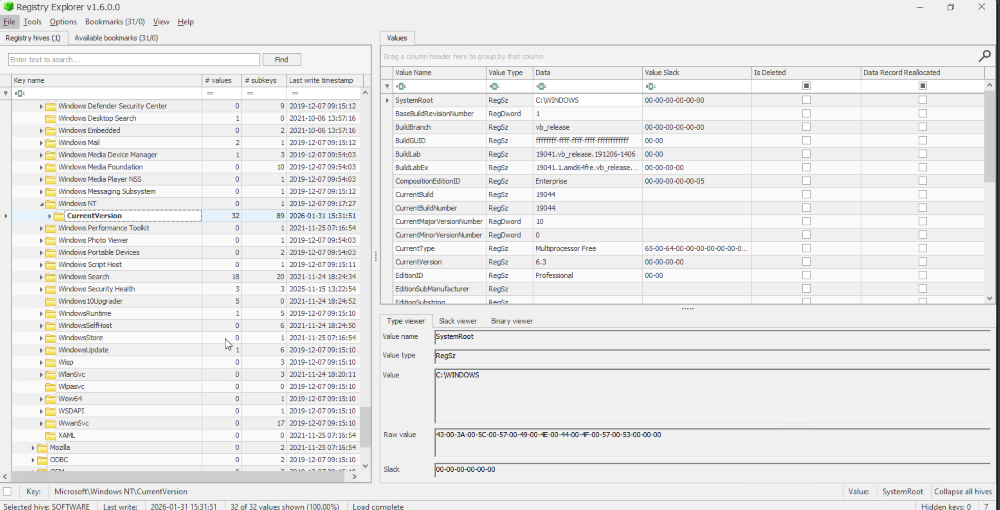

Used to find:
- Windows version
- Build number
- Install date
- Registered owner

---
🔍 Artifact 1: Computer Name

Registry Path:

SYSTEM\CurrentControlSet\Control\ComputerName\ComputerName

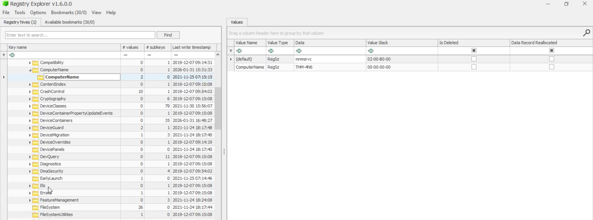
Data Visible:

Computer Name of the system

Why It Matters in Investigation:
Establishing the computer name is crucial to confirm that forensic analysis is being conducted on the correct machine. This helps avoid evidence contamination and ensures accuracy when correlating artifacts across multiple systems.

🔍 Artifact 2: Time Zone Information

Registry Path:

SYSTEM\CurrentControlSet\Control\TimeZoneInformation

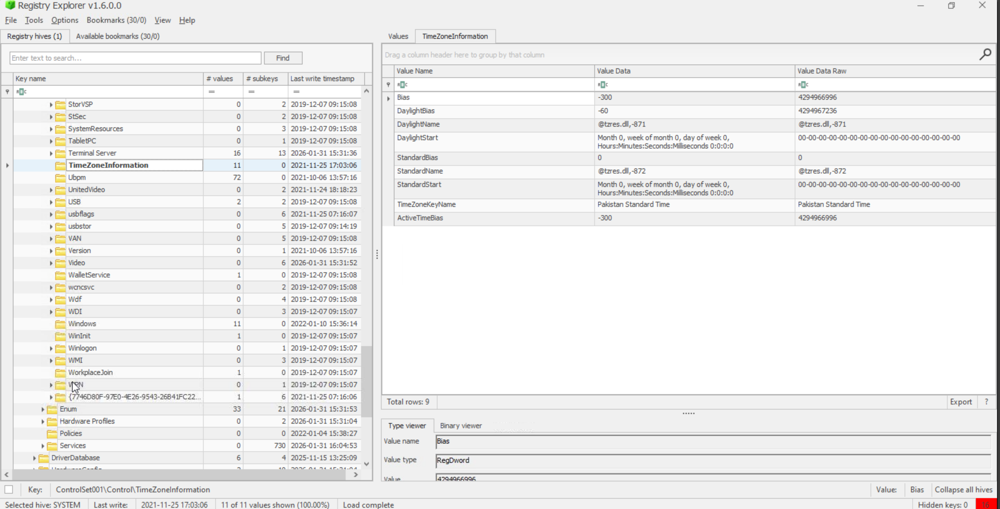
Data Visible:

Time zone name

Bias and daylight saving information

Why It Matters in Investigation:
Some system artifacts store timestamps in UTC/GMT, while others store them in local time. Knowing the system’s time zone is essential for accurate timeline reconstruction and correlation of events from multiple data sources.

🔍 Artifact 3: Network Interfaces

Registry Path:

SYSTEM\CurrentControlSet\Services\Tcpip\Parameters\Interfaces

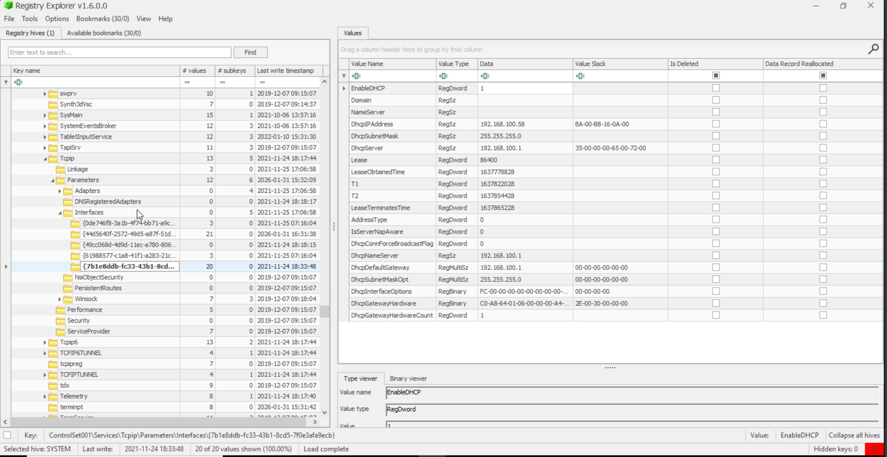
Data Visible:

Interface GUIDs

IP address

DHCP IP address

Subnet mask

DNS server information

Why It Matters in Investigation:
Each network interface is identified by a unique GUID. This information helps confirm network configuration, identify IP addresses used by the system, and verify that the analysis is being performed on the intended machine.

🔍 Artifact 4: Previously Connected Networks

Registry Paths:

SOFTWARE\Microsoft\Windows NT\CurrentVersion\NetworkList\Signatures\Unmanaged
SOFTWARE\Microsoft\Windows NT\CurrentVersion\NetworkList\Signatures\Managed

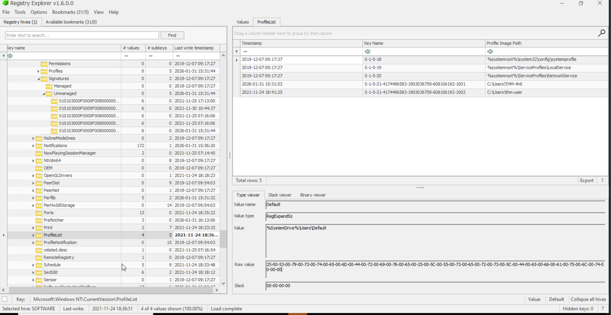

Data Visible:

Network signatures

Network identifiers

Last connected timestamps (Last Write Time)

Why It Matters in Investigation:
These keys reveal past networks the system connected to and the last time of connection. This is useful for identifying suspicious network access, tracking user movement, and supporting timeline analysis.

🔍 Artifact 5: Autostart Programs (Persistence)

Registry Paths:

NTUSER.DAT\Software\Microsoft\Windows\CurrentVersion\Run
NTUSER.DAT\Software\Microsoft\Windows\CurrentVersion\RunOnce
SOFTWARE\Microsoft\Windows\CurrentVersion\Run
SOFTWARE\Microsoft\Windows\CurrentVersion\RunOnce
SOFTWARE\Microsoft\Windows\CurrentVersion\Policies\Explorer\Run

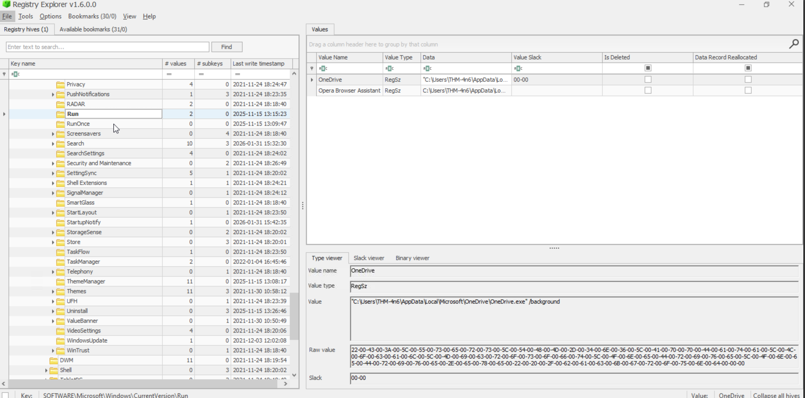

Data Visible:

Program names

Executable paths

Why It Matters in Investigation:
These keys identify programs that automatically execute at user logon. They are critical for detecting persistence mechanisms commonly used by malware and unauthorized software.

🔍 Artifact 7: User Accounts (SAM Hive)

Registry Path:

SAM\Domains\Account\Users

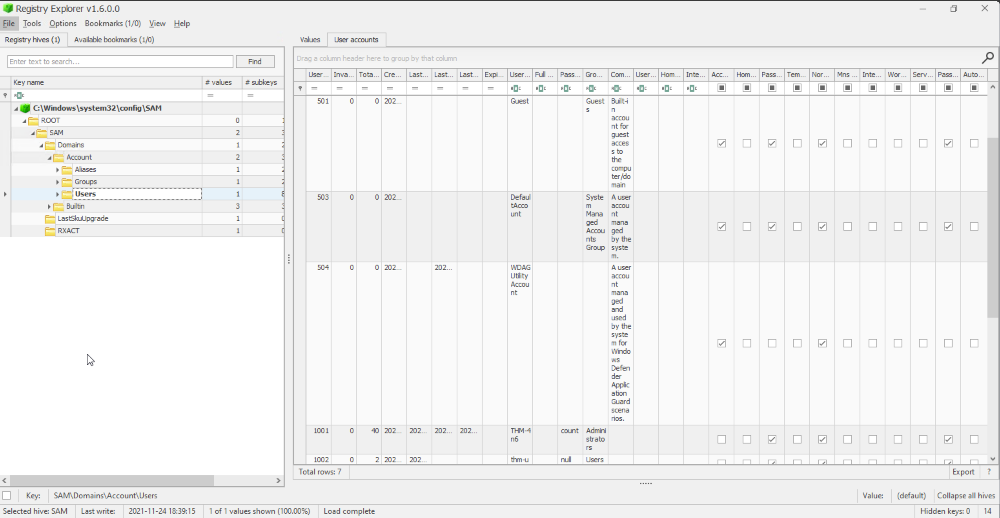

Data Visible:

User Relative Identifier (RID)

Number of logins

Last login time

Last failed login

Password change information

Group membership

Why It Matters in Investigation:
The SAM hive provides critical user account information. It helps identify legitimate and suspicious users, detect brute-force attempts, and understand account activity during an investigation.

🔍 Artifact 8: Recently Opened Files (RecentDocs)

Registry Path:

NTUSER.DAT\Software\Microsoft\Windows\CurrentVersion\Explorer\RecentDocs

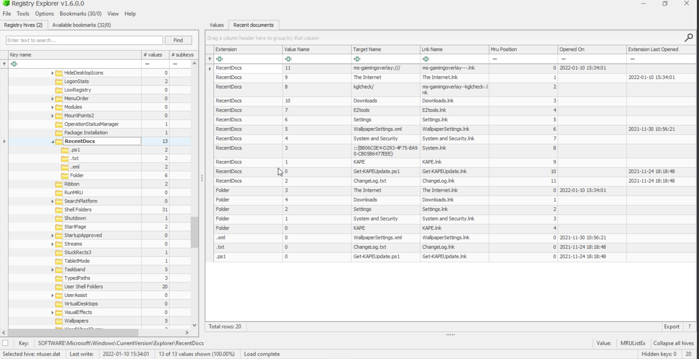

Data Visible:

Recently opened file names

File extensions

Most Recently Used (MRU) order

Last opened timestamps

Why It Matters in Investigation:
This registry key stores evidence of files recently accessed by the user. It helps investigators reconstruct user activity and identify documents accessed around the time of an incident.

🔍 Artifact 11: Open/Save Dialog MRUs

Registry Paths:

NTUSER.DAT\Software\Microsoft\Windows\CurrentVersion\Explorer\ComDlg32\OpenSavePIDlMRU
NTUSER.DAT\Software\Microsoft\Windows\CurrentVersion\Explorer\ComDlg32\LastVisitedPidlMRU

Data Visible:

Recently opened or saved file locations

Executable names

Folder paths

Why It Matters in Investigation:
These artifacts identify files and locations accessed through Open/Save dialogs, even when files are no longer present on the system.

🔍 Artifact 14: LastVisited Dialog MRUs

Registry Path:

NTUSER.DAT\Software\Microsoft\Windows\CurrentVersion\Explorer\ComDlg32\LastVisitedPidlMRU

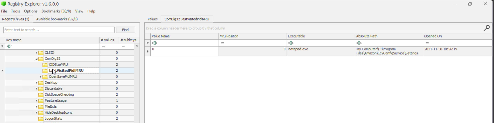

Data Visible:

Executable name of the program used to open or save files

Last accessed folder path

Most Recently Used (MRU) order

Why It Matters in Investigation:
This artifact records the last directories accessed by applications through the Open or Save dialog boxes. It helps investigators identify which programs were used and the locations from which files were accessed, even if the files themselves have been deleted.

🔍 Artifact 12: Windows Explorer Typed Paths

Registry Path:

NTUSER.DAT\Software\Microsoft\Windows\CurrentVersion\Explorer\TypedPaths

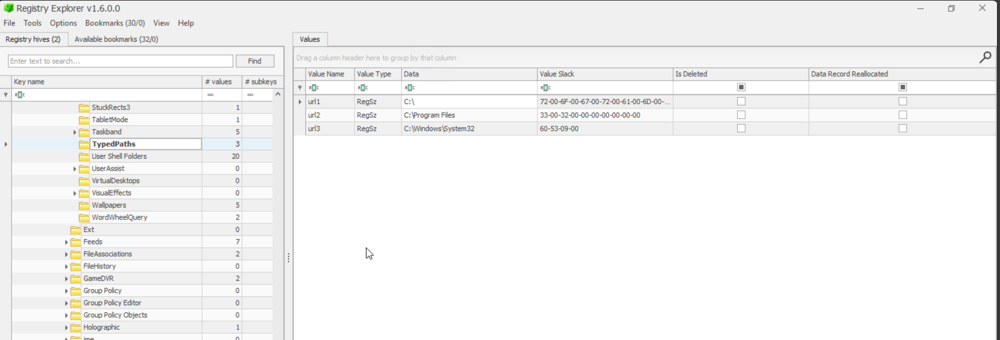

Data Visible:

Folder paths manually typed by the user

Why It Matters in Investigation:
Typed paths show deliberate access to specific directories, including hidden or sensitive locations.

🔍 Artifact 13: Windows Explorer Search History

Registry Path:

NTUSER.DAT\Software\Microsoft\Windows\CurrentVersion\Explorer\WordWheelQuery

Data Visible:

Search keywords entered by the user

Why It Matters in Investigation:
Search terms help identify user intent and can indicate attempts to locate specific files or data.

Data Visible:

Recently opened file names

File extensions

Most Recently Used (MRU) order

Last opened timestamps

Why It Matters in Investigation:
This registry key stores evidence of files recently accessed by the user. It helps investigators reconstruct user activity and identify documents accessed around the time of an incident.

🔍 Artifact: UserAssist

Purpose:
UserAssist registry keys track applications launched by a user through Windows Explorer. Windows uses this data for user activity statistics.

Registry Path:

NTUSER.DAT
\Software\Microsoft\Windows\CurrentVersion\Explorer\UserAssist\{GUID}\Count

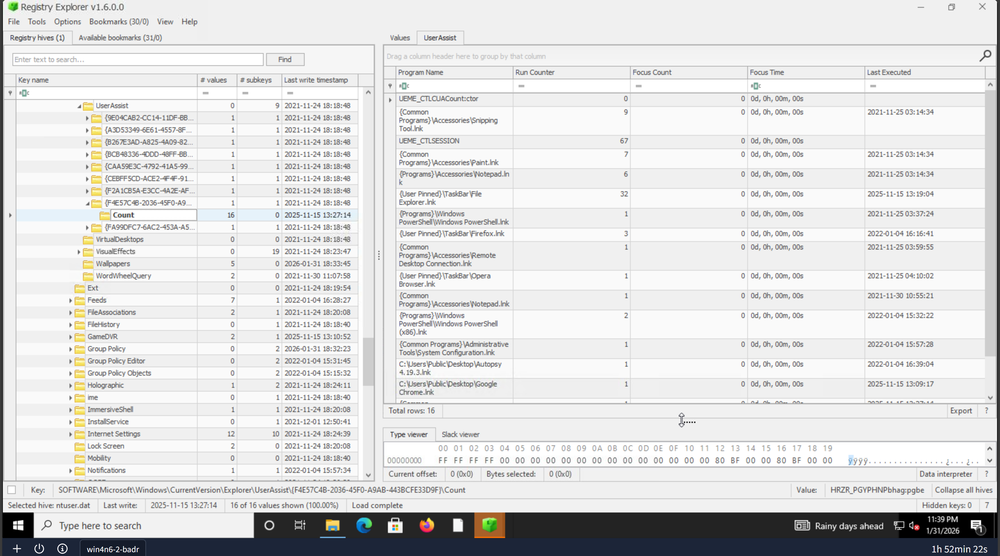

Data Visible:

Program name (ROT13 encoded)

Last execution time

Execution count

User-specific activity (per GUID)

Important Note:
Programs executed via Command Prompt or PowerShell are not recorded in UserAssist.

Why It Matters in Investigation:
UserAssist helps investigators determine:

Which applications a user actually ran

Frequency of application usage

Approximate timeline of user activity

🔍 Artifact: AmCache

Purpose:
AmCache is an advanced execution artifact related to ShimCache. It stores detailed metadata about executed programs.

Hive Location:

C:\Windows\AppCompat\Programs\Amcache.hve

Registry Path:

Amcache.hve
\Root\File\{Volume GUID}\

Data Visible:

Full execution path

Installation time

Execution time

Deletion time

SHA1 hash of executable

Why It Matters in Investigation:
AmCache is extremely valuable because it:

Confirms program execution

Helps detect renamed or deleted malware

Supports hash-based threat analysis

🔍 Artifact: BAM / DAM (Background & Desktop Activity Monitor)

Purpose:

BAM (Background Activity Monitor): Tracks background application execution

DAM (Desktop Activity Moderator): Optimizes power usage and tracks application behavior

Both are part of Modern Standby in Windows.

Registry Paths:

SYSTEM\CurrentControlSet\Services\bam\UserSettings\{SID}

SYSTEM\CurrentControlSet\Services\dam\UserSettings\{SID}

Data Visible:

Full path of executed programs

Last execution timestamp

User SID associated with execution

Why It Matters in Investigation:
BAM/DAM artifacts help:

Identify stealthy background executions

Correlate activity with user accounts

---

## 🛠️ Tools Used
- Registry Explorer
- FTK Imager
- Autopsy
- Windows OS
- GitHub

---

## 🔍 Project Workflow
1. Collected registry hive files (SAM, SYSTEM, SOFTWARE, NTUSER.DAT)
2. Loaded hives into Registry Explorer
3. Navigated key forensic registry paths
4. Extracted user and system artifacts
5. Documented findings with explanations
6. Created this GitHub project for learning and demonstration

---

## 📊 Key Findings
- Identified OS version and installation details
- Extracted user activity artifacts
- Detected startup and persistence entries
- Analyzed installed software evidence
- Understood registry-based investigation techniques

---

## 📚 Learning Outcome
- Strong understanding of Windows Registry structure
- Practical experience with registry forensic analysis
- Improved DFIR and SOC investigation skills
- Better understanding of how malware uses registry keys
- Confidence in explaining registry artifacts in interviews

---

## 👤 Author
**Ananya Arya**  
Cyber Security | SOC & Digital Forensics Enthusiast  
Windows Forensics | OSINT | Incident Response
